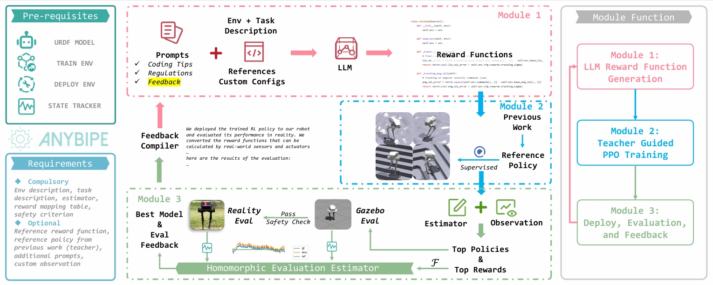

# AnyBipe: An End-to-End Framework for Training and Deploying Bipedal Robots Guided by Language Models

<div align="center">

[[Website]](https://sjtu-mvasl-robotics.github.io/anybipe/)
[[Paper]](URL)
[[Videos]](URL)

Yifei Yao<sup>1</sup>, Jiaheng Du<sup>1,†</sup>, Chenyu Gu<sup>1,†</sup>, Wentao He<sup>2,†</sup>, Fuwei Tan<sup>1</sup>, Zhen Zhu<sup>1</sup>, and Junguo Lu<sup>1</sup>

<sup>1</sup> All authors are with Machine Vision and Autonomous System Laboratory, Department of Automation, School of Electrical Information and Electronic Engineering, Shanghai Jiao Tong University, Shanghai, China,  with the Key Laboratory f System Control and Information Processing, Ministry of Education of China, and with Shanghai Engineering Research Center of Intelligent Control and Management, Shanghai 200240, China.

<sup>2</sup> Wentao He is is with University of Michigan - Shanghai Jiao Tong University Joint Institute , Shanghai Jiao Tong University, Shanghai, China 

[](https://github.com/Humanoid-Robots/AnyBipe.git)
[](https://pytorch.org/)
[](http://wiki.ros.org/noetic)
[](https://developer.nvidia.com/isaac-gym)
[](https://github.com/Humanoid-Robots/AnyBipe/blob/main/LICENSE)


______________________________________________________________________

</div>




Training and deploying reinforcement learning (RL) policies for robots, especially in accomplishing specific tasks, presents substantial challenges. Recent advancements have explored diverse reward function designs, training techniques, simulation-to-reality (sim-to-real) transfers, and performance analysis methodologies, yet these still require significant human intervention. This paper introduces an end-to-end framework for training and deploying RL policies, guided by Large Language Models (LLMs), and evaluates its effectiveness on bipedal robots. The framework consists of three interconnected modules: an LLM-guided reward function design module, an RL training module leveraging prior work, and a sim-to-real homomorphic evaluation module. This design significantly reduces the need for human input by utilizing only essential simulation and deployment platforms, with the option to incorporate human-engineered strategies and historical data. We detail the construction of these modules, their advantages over traditional approaches, and demonstrate the framework's capability to autonomously develop and refine controlling strategies for bipedal robot locomotion, showcasing its potential to operate independently of human intervention.

## Important Notice
This project is the prime version for a more completed framework. Our general framework is almost ready, but we are still working on coding migration (from `Issacgym` to `Issac Sim`), documentation, further experiments (for other robots and platforms), and more. This repository might be merged to the main framework repository in the future.

This repository is still under maintenance, it might be updated frequently. If you want to use this repository for your own robot, please checkout to stable release branches.

## Pre-requisites
To configure and run this project for your own robot, you have to make sure that following pre-requisites are satisfied:

| Pre-requisite | Description |
| --- | --- |
| Reinforcement Learning Platform | Our work supports ANYmal like training environments based on Issacgym [here](https://github.com/leggedrobotics/legged_gym.git). Your training code should be designed accordingly. |
| LLM Access | Our work is configured to use openAI's api service. You should have access to the API. |
| ROS Noetic | Our work is specialized for robots that are controlled by ROS (currently Noetic, but can support ROS2). |
| Python / C++ SDK | Your robot should have a Python / C++ SDK for controlling and receiving sensor data. |
| Teacher Model (Optional) | You can use your own teacher model for training, no matter what the model is (traditional control, RL, etc.). |

## Installation

This repository contains code for training and deploying bipedal robots using `anybipe.py`. The code contains function to generate reward functions using GPT, train the robot using Issacgym environments, deploy the training model via ROS, convert generated reward functions to real-world measurable metrics, automatically collect feedback from both Gazebo simulation and real-world experiments, and more. The robot model and sdk are provided by [limx dynamics](https://www.limxdynamics.com/en) and adjusted for our work. Training dependencies `legged_gym` and `rsl_rl` are also modified to fit our work.

Our work contains a few large resource files, it is recommended to install [git lfs](https://docs.github.com/en/repositories/working-with-files/managing-large-files/installing-git-large-file-storage) before cloning.

Since our environment requires `ROS` platform, we recommend using `Ubuntu 20.04` for the best experience. You can also use `Docker` for running the simulation environment. The following steps will guide you to install the required dependencies:

### Step 1: Install ROS Noetic

You can install ROS Noetic by following the instructions [here](http://wiki.ros.org/noetic/Installation/Ubuntu). We recommend installing the `Desktop-Full` version. Or you can use the following command to create a docker container with ROS Noetic:

```bash
xhost +
docker run --gpus all -it --device=/dev/dri  --group-add video --volume=/tmp/.X11-unix:/tmp/.X11-unix  --env="DISPLAY=$DISPLAY" --env="QT_X11_NO_MITSHM=1" --env="NVIDIA_DRIVER_CAPABILITIES=all" --network=host --rm --name ros-noetic -v $(pwd):/workspace -w /workspace  osrf/ros:noetic-desktop-full
```

To build with CUDA support, you can run the following command to build the docker image:

```bash
cd docker
docker build -t anybipe_img .
xhost +
docker run --gpus all -it --device=/dev/dri  --group-add video --volume=/tmp/.X11-unix:/tmp/.X11-unix  --env="DISPLAY=$DISPLAY" --env="QT_X11_NO_MITSHM=1" --env="NVIDIA_DRIVER_CAPABILITIES=all" --network=host --rm --name anybipe anybipe_img
```

### Step 2: Create a Conda Environment (Optional)
```bash
conda create -n anybipe python=3.8
conda activate anybipe
```

### Step 3: Install Issacgym
Download and install Issacgym from [here](https://developer.nvidia.com/isaac-gym) and unzip the file, then run the following commands:
Note that `np.float` was a deprecated alias for the builtin `float`, so you neeed to manually replace it with float. Doing this will not modify any behavior and is safe.

```bash
cd isaacgym/python
pip install -e .
sed -i 's/np.float/float/' isaacgym/torch_utils.py
```

### Step 4: Install AnyBipe to your workspace
```bash
    git clone https://github.com/Humanoid-Robots/AnyBipe.git
    pip install -e .
```
### Step 5: Install Run-time Dependencies
```bash
    cd gyms/
    cd rsl_rl/
    pip install -e .
    cd ../pointfoot-legged-gym/
    pip install -e .
```

### Step 6: Install ROS Dependencies for LIMX Robot
```bash
    cd biped_ws
    catkin_make install
    source install/setup.bash
```
If your `catkin_make` failed in this step, it means your current `ROS` environment might be missing some dependencies. You can install the missing dependencies by running the following command，and then run `catkin_make` again:

```bash
    rosdep install --from-paths src --ignore-src -r -y
```

If your `catkin_make` reports missing `onnxruntime_cxx_api.h`, it means that you haven't successfully configured your ubuntu directory for `onnxruntime` support. Consider using the following commands to include neccessary libraries (check the github page for latest release and replace the downloading link with the one that fits your system architecture):
```bash
    wget -O onnxruntime.tgz https://github.com/microsoft/onnxruntime/releases/{your_desired_release_version} # or .tar.gz, .zip
    tar -xzvf onnxruntime.tgz # or .tar.gz, .zip (use unzip for .zip)
    sudo cp -a onnxruntime/include/* /usr/include
    sudo cp -a onnxruntime/lib/* /usr/lib

```

### Step 7: Compile necessary code
```bash
    cd src/eval
    python setup.py build_ext --inplace
```

## Usage
The whole project uses locomotion of a bipedal robot provided by `limx` as an example. To configure your own robot, you have to adjust the following settings (if you only want to try our demo, you can skip this part):

1. Place your ROS package in `biped_ws/src/`

2. Register your task in `cfg/env` and modify the general training settings in `cfg/config.yaml`

3. Set up your own tracker in `src/eval/eval.py` and `src/eval/eval_real.py`

4. Set up your own mapping function from Issacgym to real-world in `src/eval/mapping/***_map.py`

5. Set up your teacher model in `src/eval/teacher` directory. The function name should be `teacher(input: torch.Tensor) -> torch.Tensor` and add teacher model info to `cfg/env/{your_task}.yaml`

6. Edit prompt for general environment and specific task under `prompts` directory.

7. Double check if your evaluation model and teacher model can be correctly loaded.

8. Add functional openAI API key to `cfg/config.yaml`

9. Copy a version of your issacgym initialization file to `envs/` directory.

10. Copy a version of your robot configuration file to `src/eval/` directory to replace `RewardCfg.py`.

11. Check and set correct path for your robot sdk in `src/eval/eval*.py` files.

When you finished the configuration part, you can start training and deploying your robot by running the following command:

```bash
    python anybipe.py env={env_name}
```

Env name can also be set in `cfg/config.yaml` file. The trained model will automatically be deployed to your robot workspace, including real-world deployment tests (you have to enable it in `cfg/env/{your_task}.yaml`).

## Prompts Structure
The prompts are structured to be both general and task-specific. The structure and functionality of the prompts are as follows:

- `general`: General prompts for the environment. It includes the following prompts:
    - `initial_system`: Initial system prompts for the environment, instructing LLM to play the role of a reward function engineer.
    - `initial_user`: Initial user prompts. Parsing the observation and task description to LLM.
    - `coding_tips`: Coding tips for LLM to generate appropriate reward functions.
    - `coding_restrictions`: Coding restrictions for LLM to generate appropriate reward functions.
    - `code_feedback`: Feedback for improving generated reward functions.
    - `execution_error_feedback`: Feedback for execution errors.
    - `policy_feedback`: Feedback for policy training and evaluation.
    - `ros_feedback`: Feedback for ROS-based deployment and evaluation.
    - `real_world_feedback`: Feedback for real-world deployment and evaluation.
- `env/{task_name}`: Task-specific prompts for the environment. It includes the following prompts:
    - `initial_system`: Initial system prompts for the environment, instructing LLM to play the role of a reward function engineer.
    - `reward_sign`: Correct form of the reward function wanted for the task.
    - `coding_references`: Human-written reward function for LLM to learn from.
    - other prompts (same name as general prompts): Task-specific prompts for the environment. To enable these prompts, you have to modify the `cfg/env/{task_name}.yaml` file.

## Code Structure
AnyBipe integrates all components into a single file `anybipe.py` for users to easily train and deploy their robots. This file provides the following functionalities:

1. **Generating Reward Functions**: The code generates reward functions using LLMs. The reward functions are generated based on the task description and the observation of the robot. The reward functions are generated in the form of code snippets that can be directly used in the training environment.

2. **Training the Robot**: The code calls corresponding `train.py` for the environment under `gyms/` directory to train the robot using the generated reward functions. The training process is done using Issacgym environments. You can specify the script path in the `cfg/env/{task_name}.yaml` file.

3. **Deploying the Robot**: The code deploys the trained model to the robot workspace. The deployment process is done using ROS. The deployment script is located in the `src/eval/scripts` directory. The corresponding calling function can be viewed in `utils/misc.py`.

4. **Converting Reward Functions to Real-world Metrics**: The code converts the generated reward functions to real-world measurable metrics. The conversion process is done using the mapping table in the `src/eval/mapping` directory. The conversion script can also be found in `utils/misc.py`.

5. **Running and Simple Pose Tracking in Gazebo and Real-world**: The code runs the robot in Gazebo simulation and real-world experiments. The tracking process is done using the tracking script in the `src/eval/eval.py` and `src/eval/eval_real.py` files. Safety check function is provided in `src/eval/SA.py`.

6. **Collecting Feedback**: The code automatically collects feedback from both Gazebo simulation and real-world experiments. The feedback collection process is done using the feedback script in the `src/eval/realworld_reward.py` file.

Additionally, the code allows you to add a teacher model during training. You have to implement your original teacher model in the `src/eval/teacher/{your_model}` directory. The teacher model should have the following function signature: `teacher(input: torch.Tensor) -> torch.Tensor`. We provide 3 different teacher models in the `src/eval/teacher` directory, including `onnx`, `pytorch`, and `trad` models. You can specify the teacher model in the `cfg/env/{task_name}.yaml` file.


## Acknowledgements
We would like to thank the authors of the following repositories for their contributions to the open-source community:
* [IsaacGym](https://developer.nvidia.com/isaac-gym): NVIDIA IsaacGym is a collection of reinforcement learning environments for training robots in NVIDIA Omniverse, our simulation and training platform.
* [Legged Gym](https://github.com/leggedrobotics/legged_gym.git) and [RSL_RL](https://github.com/leggedrobotics/rsl_rl): Awesome work done by ETH Zurich and University of Zurich allows us to train our robot in a simulated environment.
* [Eureka](https://github.com/eureka-research/Eureka): Eureka provides crucial algorithm for iteratively generating reward functions and improving the generation results, this allows us to develop an end-to-end framework for training and deploying bipedal robots guided by language models.
* [Limx Dynamics](https://github.com/limxdynamics): Limx Dynamics provides the robot model, SDK, and real-world machine for our experiments. Our evaluation is mainly based on their projects.


## License
This project is licensed under the MIT License - see the [LICENSE](LICENSE) file for details.

## Citation
If you find this work useful, please consider citing our paper:

```bibtex
@misc{yao2024anybipeendtoendframeworktraining,
      title={AnyBipe: An End-to-End Framework for Training and Deploying Bipedal Robots Guided by Large Language Models}, 
      author={Yifei Yao and Wentao He and Chenyu Gu and Jiaheng Du and Fuwei Tan and Zhen Zhu and Junguo Lu},
      year={2024},
      eprint={2409.08904},
      archivePrefix={arXiv},
      primaryClass={cs.RO},
      url={https://arxiv.org/abs/2409.08904}, 
}
```
