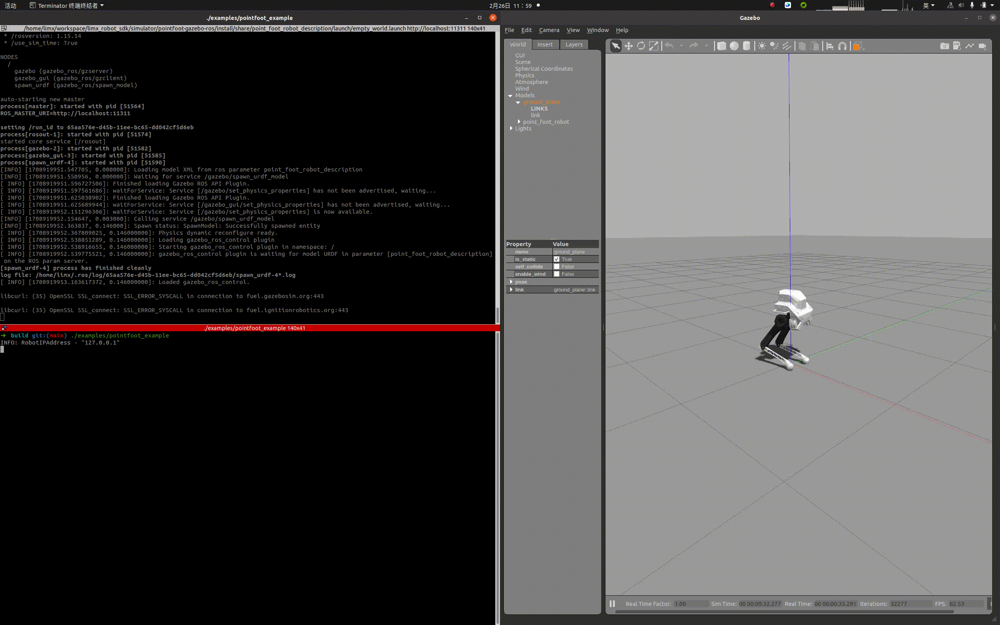

# pointfoot-gazebo-ros


## 1. 搭建开发环境

我们推荐在 Ubuntu 20.04 操作系统上建立基于 ROS Noetic 的算法开发环境。ROS 提供了一系列工具和库，如核心库、通信库和仿真工具（如 Gazebo），极大地便利了机器人算法的开发、测试和部署。这些资源为用户提供了一个丰富而完整的算法开发环境。

ROS Noetic 安装请参考文档：https://wiki.ros.org/noetic/Installation/Ubuntu ，选择“ros-noetic-desktop-full”进行安装。ROS Noetic 安装完成后，Bash 终端输入以下 Shell 命令，安装开发环境所依赖的库：

```
sudo apt-get update
sudo apt install ros-noetic-urdf \
                 ros-noetic-kdl-parser \
                 ros-noetic-urdf-parser-plugin \
                 ros-noetic-hardware-interface \
                 ros-noetic-controller-manager \
                 ros-noetic-controller-interface \
                 ros-noetic-controller-manager-msgs \
                 ros-noetic-control-msgs \
                 ros-noetic-ros-control \
                 ros-noetic-gazebo-* \
                 ros-noetic-rqt-gui \
                 ros-noetic-rqt-controller-manager \
                 ros-noetic-plotjuggler* \
                 cmake build-essential libpcl-dev libeigen3-dev libopencv-dev libmatio-dev \
                 python3-pip libboost-all-dev libtbb-dev liburdfdom-dev liborocos-kdl-dev -y
```

## 2. 创建工作空间

可以按照以下步骤，创建一个算法开发工作空间：

- 打开一个 Bash 终端。

- 创建一个新目录来存放工作空间。例如，可以在用户的主目录下创建一个名为“limx_ws”的目录：

  ```
  mkdir -p ~/limx_ws/src
  ```

- 下载运动控制开发接口：

  ```
  cd ~/limx_ws/src
  git clone https://github.com/limxdynamics/pointfoot-sdk-lowlevel.git
  ```

- 下载 Gazebo 仿真器：

  ```
  cd ~/limx_ws/src
  git clone https://github.com/limxdynamics/pointfoot-gazebo-ros.git
  ```

- 下载机器人模型描述文件

  ```
  cd ~/limx_ws/src
  git clone https://github.com/limxdynamics/robot-description.git
  ```

- 编译工程：

  ```
  cd ~/limx_ws
  catkin_make install
  ```

- 运行仿真

  ```
  source install/setup.bash
  roslaunch pointfoot_gazebo empty_world.launch
  ```

- 运行控制例程，确保仿真器中机器人有运动，说明仿真环境搭建完成：

  ```
  source install/setup.bash
  rosrun pointfoot_sdk_lowlevel pf_groupJoints_move
  ```
  
